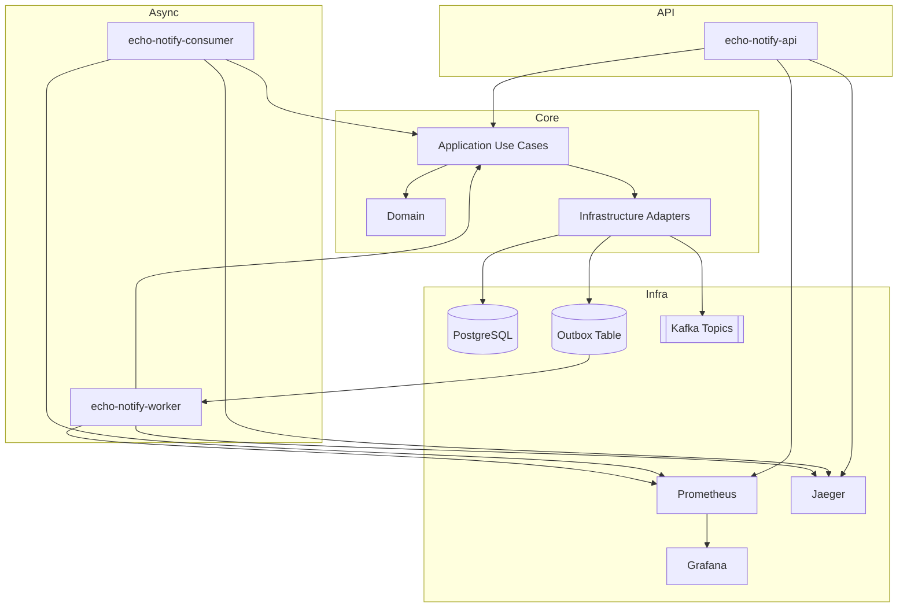

# Architecture

## Text diagram

- Entrypoint: `echo-notify-api` (Ktor REST + OpenAPI)
- Application: use cases for send, process, retry and query status
- Domain: entities, ports and strategies
- Infrastructure: Kafka, PostgreSQL/Flyway, channel adapters, resilience adapters
- Async processing: `echo-notify-consumer` + `echo-notify-worker`
- Observability: W3C trace context propagated in Kafka headers and continued in consumer/worker spans

## Visual suggestion

