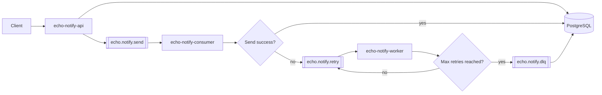

# Event Flow

1. API receives `POST /v1/notifications`
2. Idempotency and rate limit checks
3. Notification persisted as `PENDING`
4. Message published to `echo.notify.send`
5. `echo-notify-consumer` processes and sends via strategy channel
6. On transient failure, status set to `FAILED` and event goes to `echo.notify.retry`
7. `echo-notify-worker` retries with exponential backoff
8. On max attempts reached, message is published to `echo.notify.dlq`

